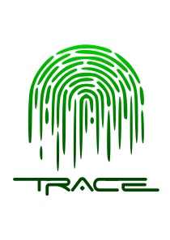

# 👋 Welcome to Trace


**Please note:** Trace is in the early stages of development, and so is this documentation. We endeavour to progress coding and docs together, so watch this space as it evolves.&#x20;


## Overview

> Trace is a Web3 interface which aims to bring blockchain-based traceability to small producers needing it the most, abating costs and increasing adoption.

<figure><figcaption></figcaption></figure>

## Quick links


[what-we-do.md](overview/what-we-do.md)



[our-features.md](fundamentals/our-features.md)

