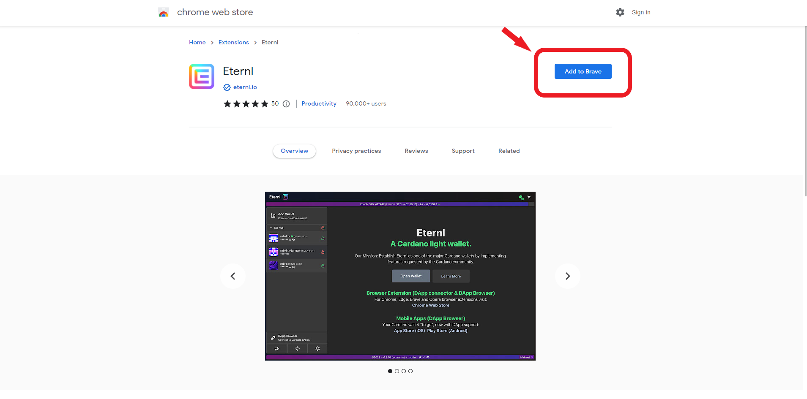
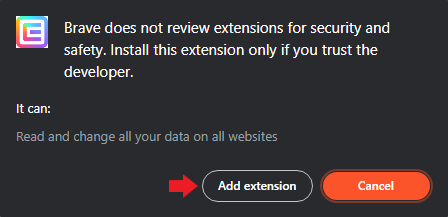

# 🛠 Getting started


**Tip:** Although not mandatory, we recommend using **Brave Browser** for best-in-class online privacy. All examples in this guide are Brave-based.




## Step1: Add Eternl to your browser


**Eternl** is a Cardano light **wallet**, which is available as a browser extension.&#x20;


Click [here](https://chrome.google.com/webstore/detail/eternl/kmhcihpebfmpgmihbkipmjlmmioameka) to open the Chrome Web Store and add it to your browser:

<figure><figcaption></figcaption></figure>

 

<figure><figcaption></figcaption></figure>

## Step 2: Create a new wallet&#x20;

## Step 3: Connect your wallet to Trace

## Step 4: Mint your Producer NFT

## Step 5: Enter Producer Zone and start Tracing

