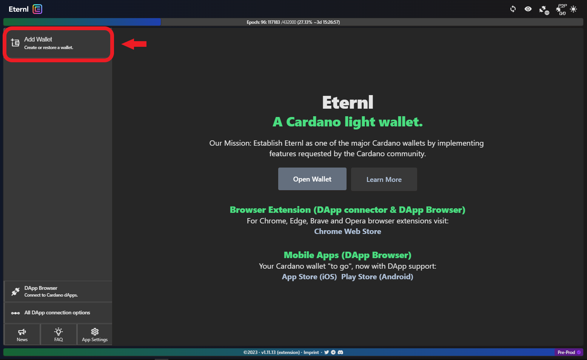

# 🛠 Getting started


**Tip:** We recommend using **Brave Browser** for best-in-class online privacy. All examples in this guide are Brave-based.




## Step1: Add Eternl to your browser


**Eternl** is a Cardano light **wallet**, which is available as a browser extension.&#x20;


Click [here](https://chrome.google.com/webstore/detail/eternl/kmhcihpebfmpgmihbkipmjlmmioameka) to open the Chrome Web Store and add it to your browser:

<figure><figcaption></figcaption></figure>

 

<figure><figcaption></figcaption></figure>

## Step 2: Create a new wallet&#x20;


To interact with Apps on the Cardano Blockchain, a **wallet is required**. Below you'll create your first one :thumbsup:&#x20;


Open the **Eternl** extension (top right corner of your browser). You will see the following in a new tab:

<figure><figcaption>
Acknowledge the version changes.
</figcaption></figure>

 

<figure><figcaption>
Click on "Mainnet" to change network for your new wallet.
</figcaption></figure>

Select **Pre-Production Testnet**:

<figure><figcaption>
Testnets on Cardano are free-to-use and allow developers to test their work. 
</figcaption></figure>

Click **Add Wallet**:

<figure><figcaption>
From here you can add Cardano wallets in many ways, we'll make a new one!
</figcaption></figure>

Click **Create Wallet**:

<figure><figcaption></figcaption></figure>


**Before you proceed**: the next step is **Absolutely Private** (like your PINs and Passwords). Make sure you guard your 24-word phrase like you would your valuables, and always keep it **offline**.&#x20;


## Step 3: Connect your wallet to Trace

**WIP:** The platform's functionality is being completed and tested. Documentation will follow shortly. &#x20;

## Step 4: Mint your Producer NFT

**WIP:** The platform's functionality is being completed and tested. Documentation will follow shortly.

## Step 5: Enter Producer Zone and start Tracing

**WIP:** The platform's functionality is being completed and tested. Documentation will follow shortly.

