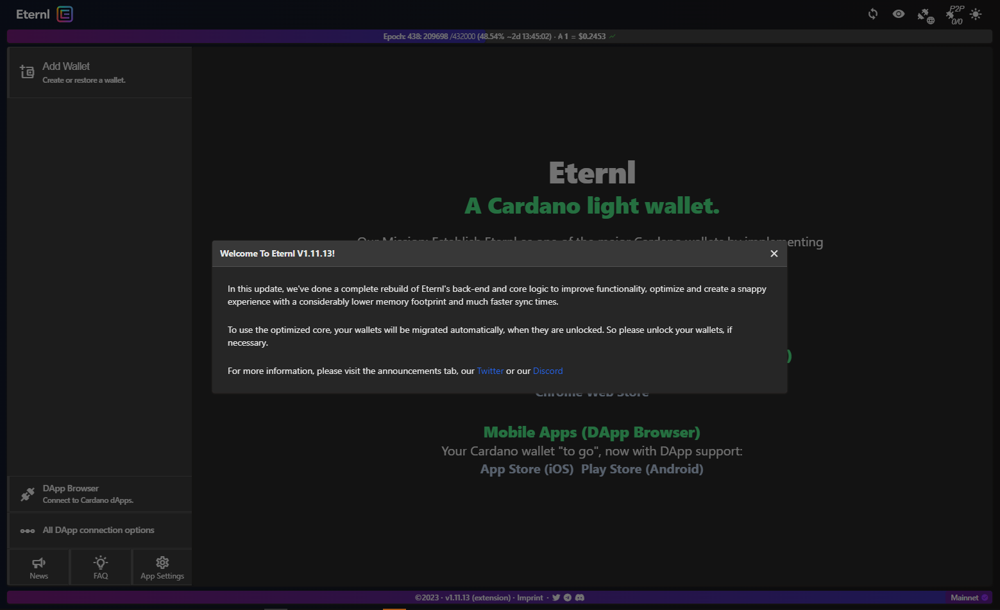
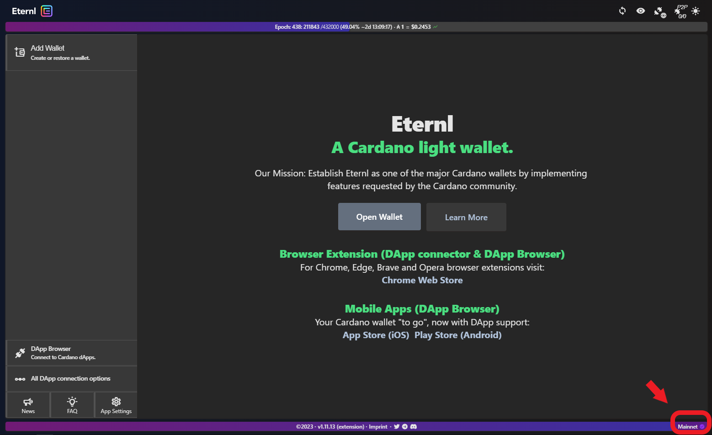
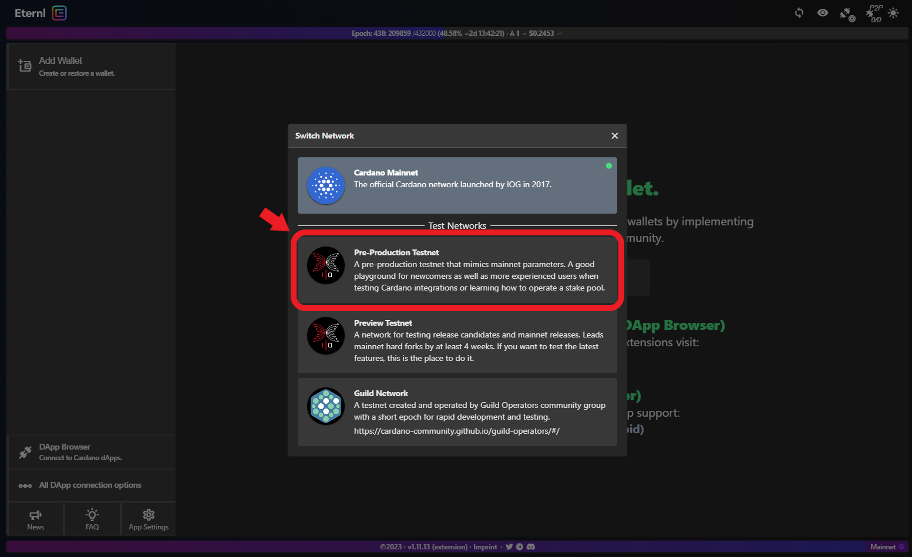
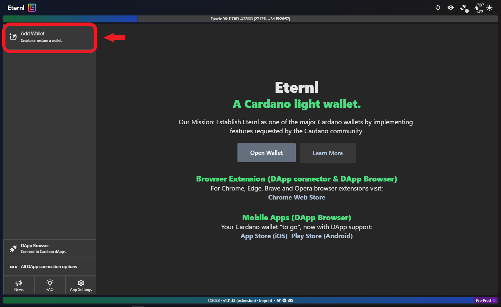
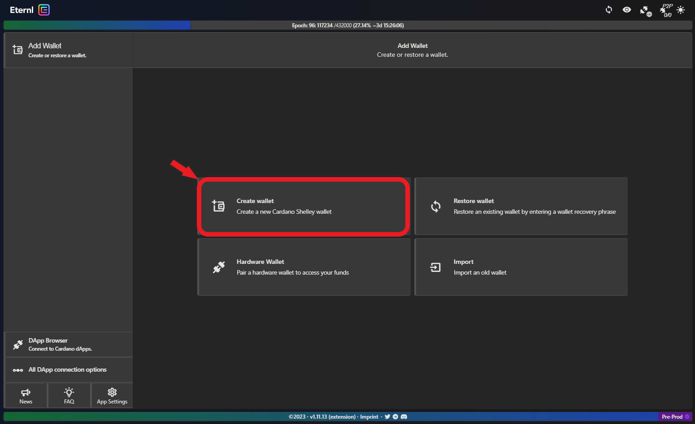
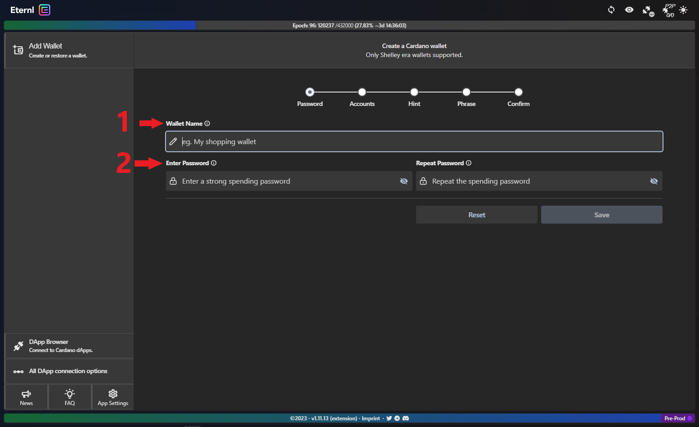
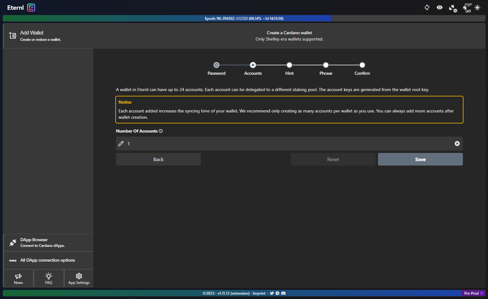
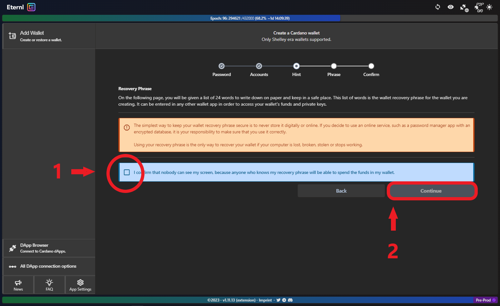

# 👛 2: Create a new wallet


To interact with Apps on the Cardano Blockchain, a **wallet is required**. Below you'll create your first one :thumbsup:&#x20;


Open the **Eternl** extension (top right corner of your browser). You will see the following in a new tab:

<figure><figcaption>
Acknowledge the version changes.
</figcaption></figure>

 

<figure><figcaption>
Click on "Mainnet" to change network for your new wallet.
</figcaption></figure>

Select **Pre-Production Testnet**:

<figure><figcaption>
Testnets on Cardano are free-to-use and allow developers to test their work. 
</figcaption></figure>

Click **Add Wallet**:

<figure><figcaption>
From here you can add Cardano wallets in many ways, we'll make a new one!
</figcaption></figure>

Click **Create Wallet**:

<figure><figcaption></figcaption></figure>

Choose a **name** to identify your wallet and a **strong password**:

<figure><figcaption></figcaption></figure>


**Please note:** Your wallet name and password are only stored locally. If you were to loose access to your wallet, the **recovery phrase** (see below) is the only means to recover your wallet. If you need to do this, you will be prompted for a new name and password. &#x20;


We will only need one **Account** for the time being. Please click **Save**:

<figure><figcaption></figcaption></figure>


**Before you proceed**: From this point onward **follow the onscreen instructions to the letter**. Please make sure you understand what the **recovery phrase** is for, and how to best **keep it safe**.



**Tip:** Store your mnemonic on **paper** (a notebook that you will not loose): make 3 copies and keep them in at least 2 separate _physical_ locations.


**Acknowledge** that nobody can see your screen and click **continue:**

<figure><figcaption></figcaption></figure>
