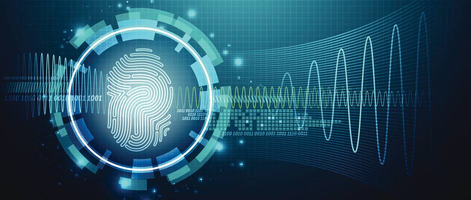

# ✨ Our Features


**Please note:** This feature list is being populated as the platform develops. Changes may be dictated by development constraints, but most importantly will shape based on **Community Feedback**.  &#x20;


## For Producers

Producers will have access to a dedicated minting service, through which they will be **minting their Company NFTs**. NFTs minted this way will contain Company Information and logos. An intuitive UI will allow Producers to upload their Company logos which will be permanently stored on IPFS, through automatically generated links.&#x20;

Company NFTs will allow access to a Producer Dashboard, where companies will be able to enter information regarding their products. Each product and batch will correspond to a QR code to follow the product in the physical world, and a product NFT to give it a digital identity.&#x20;

<figure><figcaption></figcaption></figure>

## For Consumers

Consumers will have access, through a QR Code, to a dynamically generated product page. These pages will enable a direct Producer-Consumer interaction, as well as Social Media information sharing.&#x20;

Future developments may include the ability to keep track of QR Code scans through Web3-enabled wallets.&#x20;

