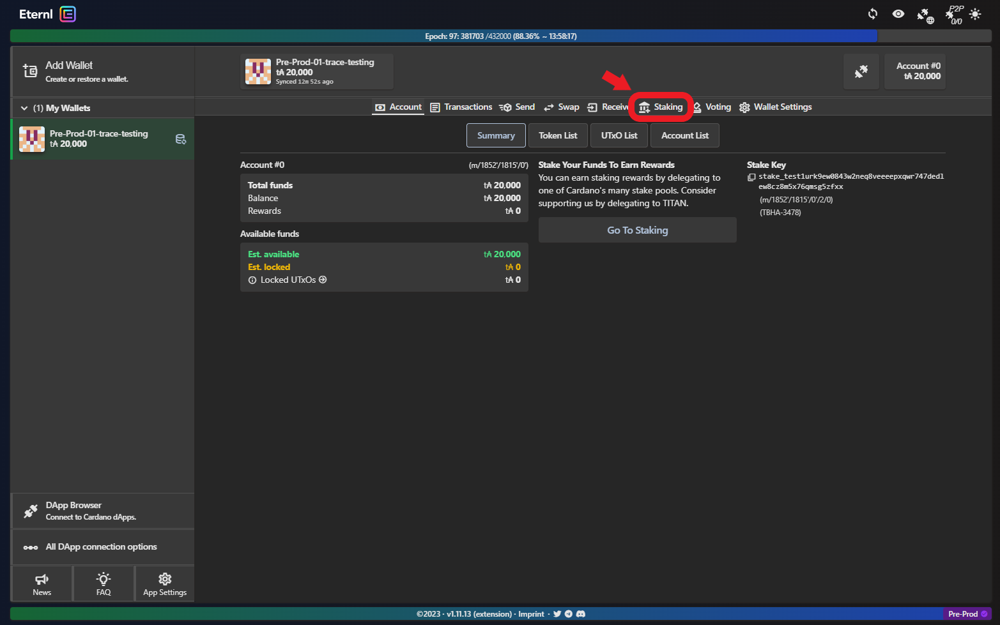
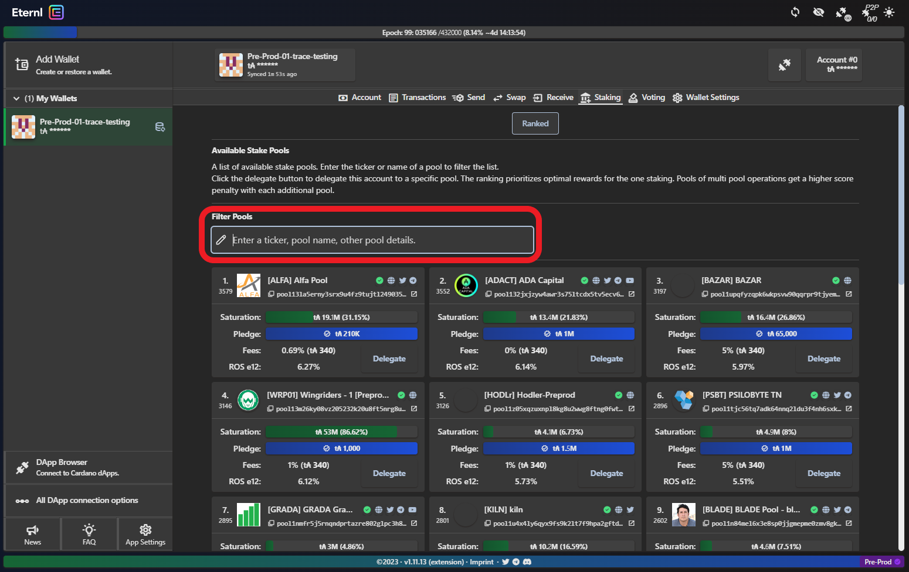
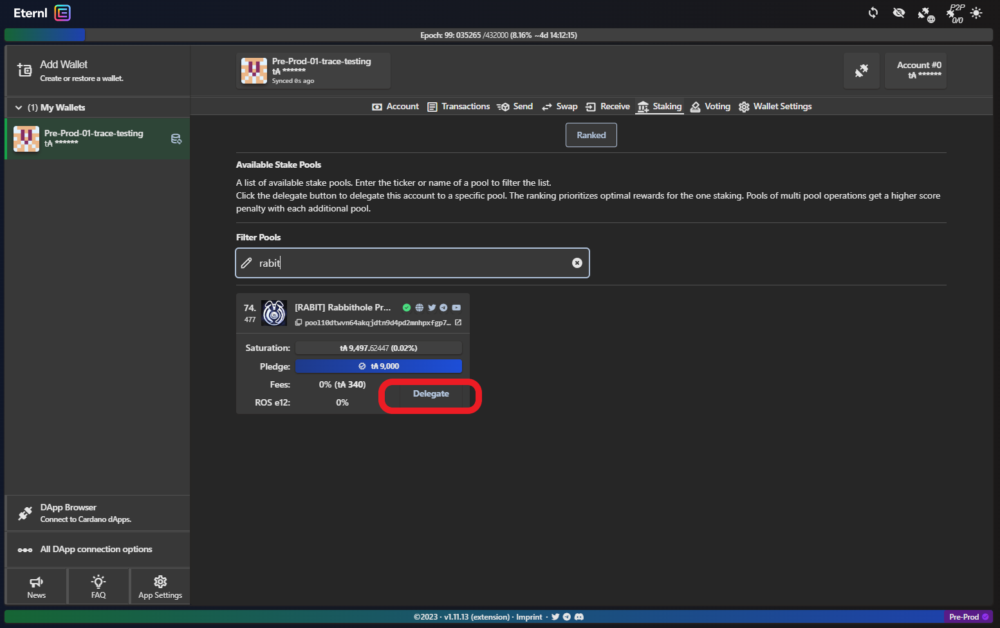
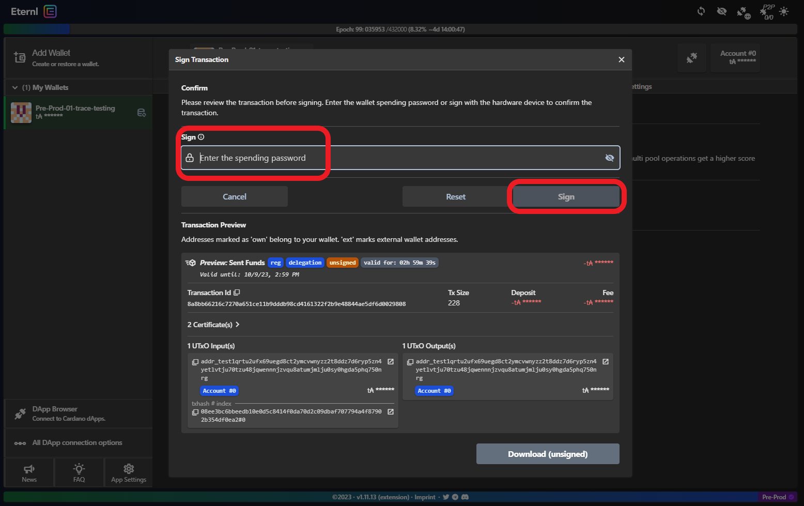
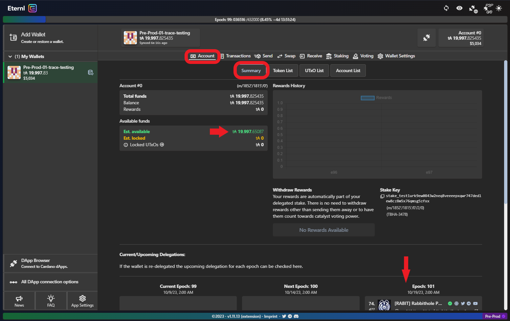

# 🤝 Delegating to a Stake Pool

Now that you've [created your wallet](../introduction/getting-started/new-wallet.md) and [funded](funding-a-cardano-testnet-wallet.md) it :tada:, you want to consider delegating to a Stake Pool.&#x20;

There is no valid reason not to delegate your stake to a Pool and it can be done by following the steps below. If you would like to know more about Staking on Cardano, please refer to the original post by [Prof. Aggelos Kiayias, Chief Scientist for Cardano](https://iohk.io/en/blog/posts/2020/11/13/the-general-perspective-on-staking-in-cardano/).&#x20;

Click on **Staking** from your Wallet's page**:**

<figure><figcaption></figcaption></figure>

Type the **name or ticker of the pool** you wish to delegate to:

<figure><figcaption></figcaption></figure>

 

<figure><figcaption></figcaption></figure>


If you want to support development of Trace, please delegate to RABIT. There are many other pools on Pre-Production and I will recommend some below:\
\
[RABIT](https://rabbitholepools.io) - [APEX](https://apexpool.info/) - [ENVY](https://www.envystakepool.com/) - [PANL](https://www.panl.org/) - [PSBT](https://psilobyte.io/)


Enter your **spending password** and click **Sign**:

<figure><figcaption>
Please take note of the fees required by the network.
</figcaption></figure>


**Please note:** every time you send a transaction on Cardano, you will incur a fee. This is NOT REFUNDABLE. The deposit (of 2 ADA) that you paid to delegate is REFUNDABLE if and when you should choose to stop delegating. You will not have to pay the deposit again if you change pool.&#x20;


Back on your wallet's main page (**Account > Summary**), you'll see the **updated balance** (after fees and deposit of the stake key) and your **pool preference**:

<figure><figcaption></figcaption></figure>


**Please note:** you'll notice that your pool choice won't take effect until 2 epochs from now. This is normal. All changes in Cardano take 2 epochs to take effect (delegation, reward distribution, etc). More on this topic on [Cardanians' Medium](https://cardanians-io.medium.com/cardano-staking-practical-information-3c86cbc73bd4).



**Success!** Now that your wallet is delegated to a pool, you will start accruing rewards. The funds are still in your **full control**: you can spend them, transfer them, delegate them to a different pool. &#x20;

