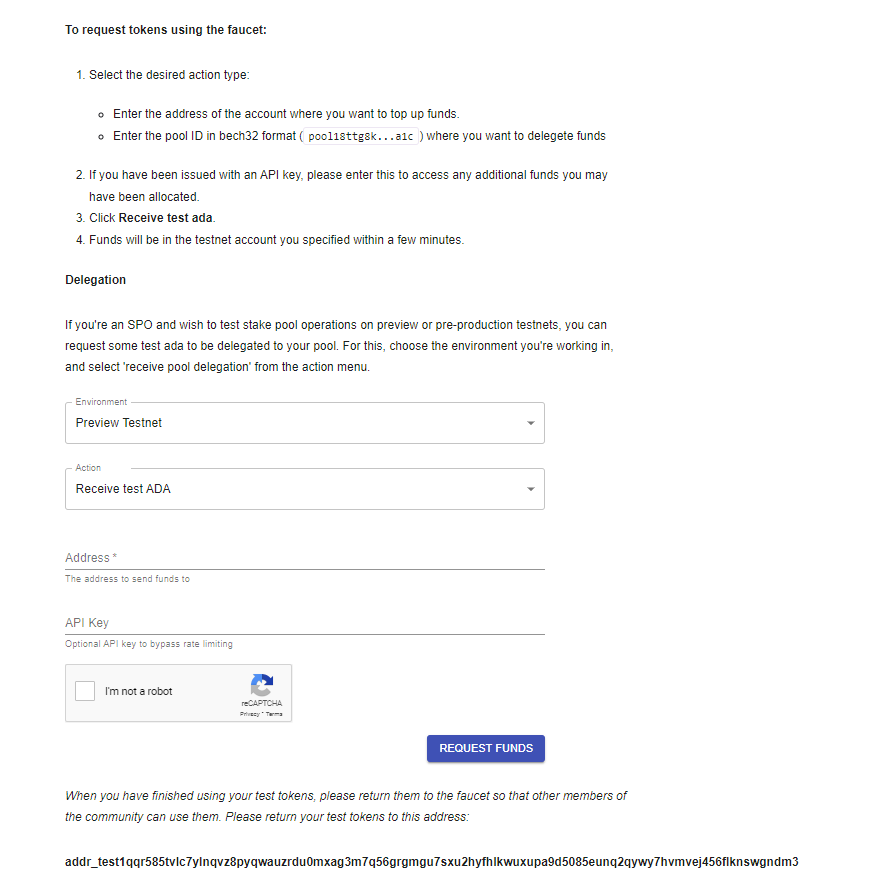
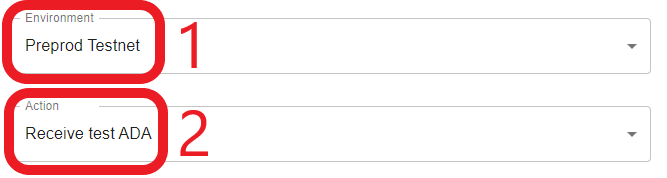
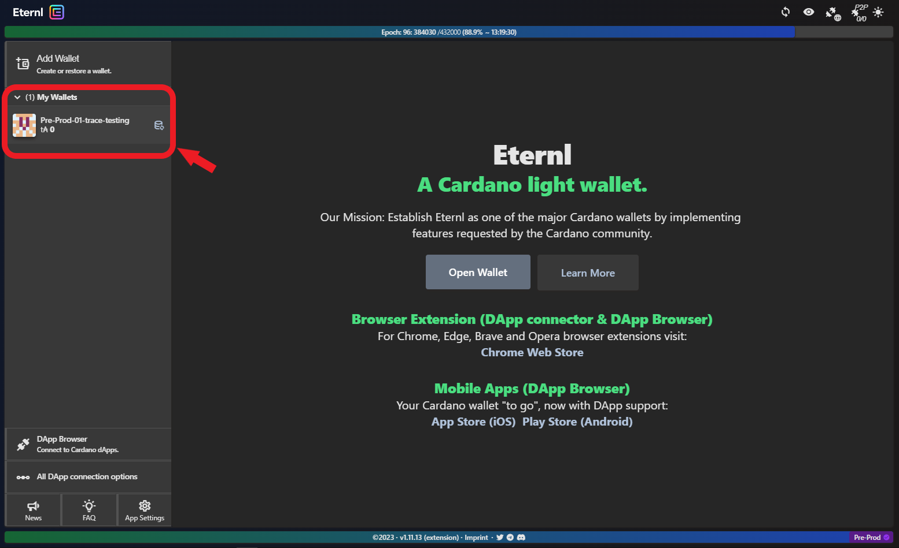
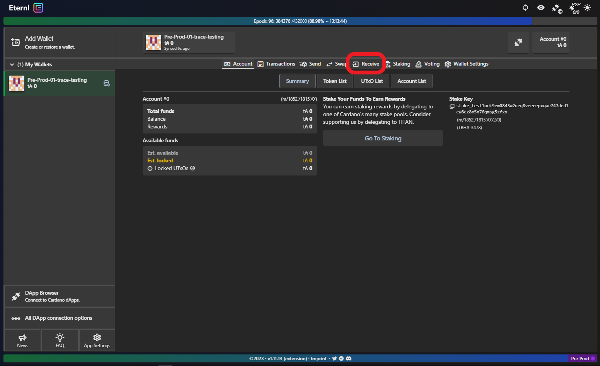
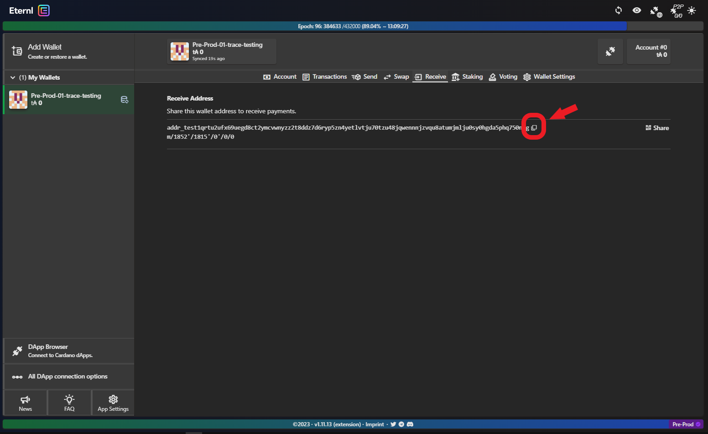
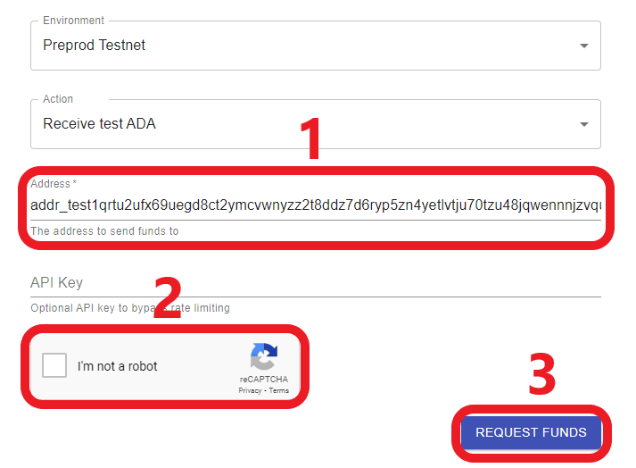
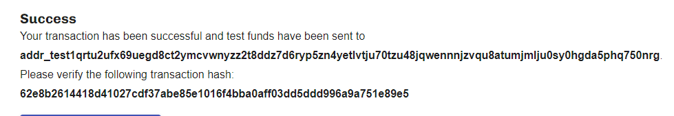
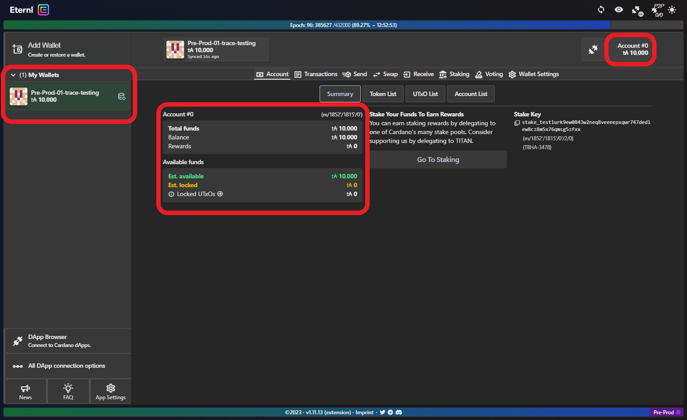

# 💰 Funding a Cardano Testnet Wallet


**Please note:** tADA tokens you receive from the Faucet should be returned to the address provided on the Faucet page when you are done using them. &#x20;


Navigate to the Testnets Faucet on [this page](https://docs.cardano.org/cardano-testnets/tools/faucet) to request some funds for your wallet:&#x20;

<figure><figcaption></figcaption></figure>

For "Environment" select **Preprod Testnet** and for "Action" leave **Receive test ADA**:

<figure><figcaption></figcaption></figure>

&#x20;Open **Eternl** and from the sidebar **choose your wallet** (it'll have a different name from mine):

<figure><figcaption></figcaption></figure>

From the **Eternl Taskbar** click **Receive**:

<figure><figcaption></figcaption></figure>

Copy your **Receive Address** to clipboard using the copy button:

<figure><figcaption>
As for the wallet name, your address will be different from above 
</figcaption></figure>

Go back to the Testnets Faucet page. **Paste your address** in the field provided, **acknowledge your human status** and click **Request Funds**:

<figure><figcaption></figcaption></figure>

If everything went well you should see a confirmation looking like this:

<figure><figcaption></figcaption></figure>

Go back to **Eternl**. Your funds (10,000 tADA) should be credited shortly:

<figure><figcaption></figcaption></figure>


You are now ready to [connect your funded wallet to Trace](../introduction/getting-started/3-connect-your-wallet-to-trace.md) and start using the app :tada:&#x20;

